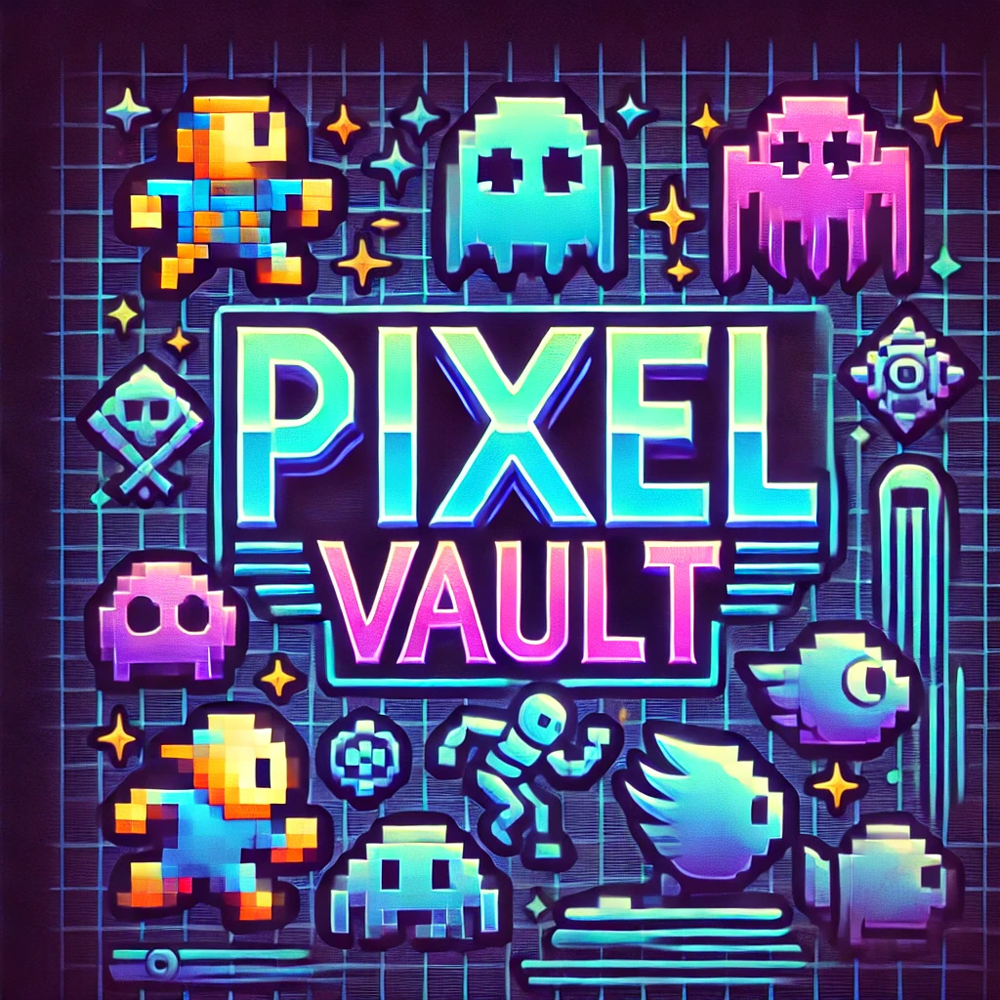

# Pixel_Vault
Projeto individual para o 1º Semestre de Análise e Desenvolvimento de Sistemas.

## Visão Geral do Projeto

Este projeto foi criado para oferecer um ambiente agrádavel a quem se interessar por jogos clássicos, onde os usuários poderão ter acesso a informações e curiosidades de jogos antigos, além de ter uma área de jogos que armazenará status de horas jogadas, pontuações, jogos favoritos e muito mais!

## Tecnologias utilizadas

- Frontend: HTML, CSS
- Backend: Javascript com node.js
- Database: MySQL

## Contribuição
Está restrito aos alunos da SPTech do 1 ADSA da São Paulo Tech School

## Licença 
O projeto é para fins acadêmicos sem fins lucrativos.

